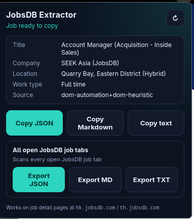

# Job Extractor

A Firefox extension that pulls structured job details from [JobsDB](https://www.jobsdb.com) (Hong Kong & Thailand) and [LinkedIn](https://www.linkedin.com/jobs/) job pages, and lets you copy or export them as JSON, Markdown, or plain text.



## Features

- **One-click extract** from the current job page (popup or on-page button)
- **Multiple output formats**: JSON, Markdown, plain text
- **Bulk export** of every open JobsDB / LinkedIn job tab into a single downloadable file
- **Robust parsing** — merges data from JSON-LD, embedded page data, and DOM selectors so it still works when the site layout shifts
- Works on:
  - `hk.jobsdb.com` / `th.jobsdb.com` job detail pages
  - LinkedIn job pages on any regional host (`www`, `hk`, …) with `/jobs/view/…` in the URL  
    (search/collection tabs like `/jobs/search` are ignored)

### Fields extracted

| Field | Examples |
| --- | --- |
| Title, company, company URL | |
| Location, salary, work type / arrangement | |
| Classification, posted date | |
| Highlights (bullet points) | |
| Full description (text + HTML) | |
| Job ID, page URL, extraction timestamp | |

## Install (temporary / development)

1. Open Firefox and go to `about:debugging#/runtime/this-firefox`
2. Click **Load Temporary Add-on…**
3. Select the `manifest.json` file from this folder
4. Open a job detail page on JobsDB or LinkedIn and use the extension

> Temporary add-ons are removed when Firefox restarts. Reload the add-on from the same page after each restart, or after you change the code.

### Permanent install (optional)

Build an `.xpi` (see below) and install it via `about:addons` → gear icon → **Install Add-on From File…**, or upload it to [Mozilla Add-on Developer Hub](https://addons.mozilla.org/developers/) for signing / listing.

## Build the `.xpi` package

Requires `zip` on your PATH (`pacman -S zip`, `apt install zip`, etc.).

```bash
./scripts/build-xpi.sh
```

The script reads the version from `manifest.json` and writes:

```text
dist/jobsdb-extractor-<version>.xpi
```

Only runtime files are packed (`manifest.json`, `background/`, `content/`, `popup/`, `icons/`). Docs, git metadata, and `dist/` itself are left out.

### Upload to Mozilla Developer Hub

1. Run `./scripts/build-xpi.sh`
2. Sign in at [addons.mozilla.org/developers](https://addons.mozilla.org/developers/)
3. Create a new add-on (or open an existing one) → **Upload New Version**
4. Upload `dist/jobsdb-extractor-<version>.xpi`  
   (a `.zip` with the same contents is also accepted — `.xpi` is just a zip)
5. Complete the listing / distribution options and submit for review  
   Use **On this site** for a public listing, or **On your own** (unlisted) if you only need a signed file to share privately

After Mozilla signs it, you can install the returned file in Firefox like any other add-on.

> Tip: bump `"version"` in `manifest.json` before each Hub upload — AMO rejects reuse of an already-submitted version string.

## How to use

### Single job

1. Open a job detail page — for example:
   - JobsDB: `https://hk.jobsdb.com/.../job/12345678`
   - LinkedIn: `https://www.linkedin.com/jobs/view/1234567890`
2. Either:
   - Click the floating **Extract** button on the page (copies JSON to the clipboard), or
   - Open the extension popup from the toolbar.
3. In the popup you’ll see a short summary. Use:
   - **Copy JSON** — structured object for scripts / APIs
   - **Copy Markdown** — ready for notes or docs
   - **Copy text** — plain readable dump  
   Use **↻** if the page was still loading or you navigated to another job.

### Bulk export

1. Open one or more JobsDB / LinkedIn job tabs in the same Firefox window/session.
2. Open the extension popup.
3. Under **All open job tabs**, choose:
   - **Export JSON** — `{ exportedAt, count, jobs: [...] }`
   - **Export MD** — jobs separated by `---`
   - **Export TXT** — jobs separated by a text divider  

The file downloads automatically (e.g. `jobs-20260929-120000.json`). JSON exports include `count`, `uniqueJobIds`, and `tabCount` so you can spot truncated downloads or duplicate job ids.

## Requirements

- Firefox **109+** (Manifest V3 / `browser_specific_settings.gecko`)
- Permissions used: `activeTab`, `tabs`, `clipboardWrite`, `storage`, plus host access to `*.jobsdb.com` and `linkedin.com`

## Project layout

```
├── manifest.json          # Extension manifest (MV3)
├── scripts/
│   └── build-xpi.sh       # Builds dist/jobsdb-extractor-<version>.xpi
├── background/
│   └── background.js      # Saves last extracted job
├── content/
│   ├── extract.js         # Shared helpers + JobsDB parsing + formatters
│   ├── extract-linkedin.js # LinkedIn parsing
│   ├── content.js         # Floating Extract button + messaging
│   └── content.css
├── popup/
│   ├── popup.html
│   ├── popup.js           # Single-job copy + bulk export UI
│   └── popup.css
└── icons/
```

## Troubleshooting

| Problem | What to try |
| --- | --- |
| “Open a JobsDB or LinkedIn job page…” | You’re not on a supported job URL — open a JobsDB `/job/…` page or LinkedIn `/jobs/view/…`. |
| “Content script unavailable” / “refresh the tab” | Reload the job tab, then open the popup again. |
| Bulk export finds tabs but all fail | Refresh those job tabs so the content script can inject. |
| Empty or partial LinkedIn fields | Sign in if needed, wait for the panel to finish loading, then hit **↻**. You do **not** need to click “See more” — the extractor reads the full description from the page/API. After updating the add-on, reload it in `about:debugging` and refresh the LinkedIn tab (regional hosts like `hk.linkedin.com` are supported). |
| Empty or partial JobsDB fields | Wait for the page to finish loading, then hit **↻**. Site changes can reduce coverage; the extractor falls back across several data sources. |

## Privacy

Everything runs locally in your browser. Job data is only written to the clipboard, downloaded files you choose, and Firefox `storage.local` for the last extract / last bulk export. Nothing is sent to a remote server. The manifest declares `data_collection_permissions.required: ["none"]` for Firefox’s built-in data-consent prompt.

## License

Use and modify freely for your own workflows.
